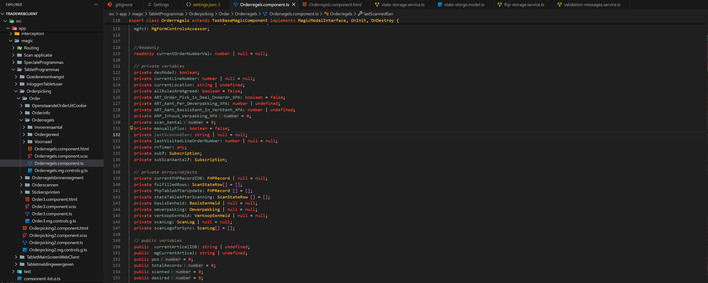
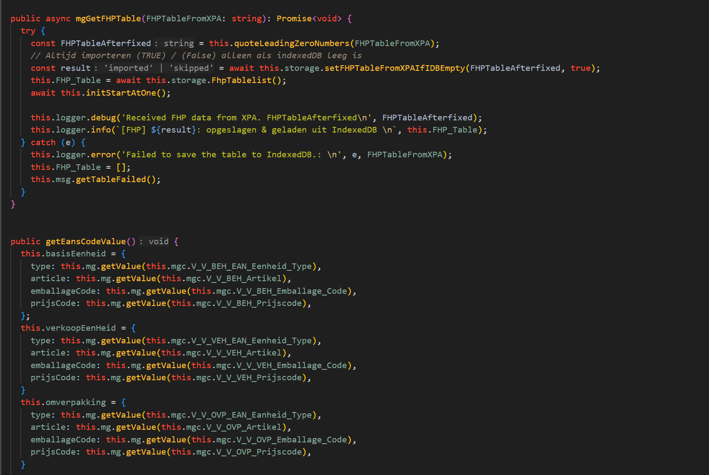

# VS Code code colors (Gruvbox)

This repo contains a `vscode-settings.json` file with my VS Code **code color** settings (token colors + semantic tokens).

## How to use in VS Code (User settings)

1. Open VS Code
2. Press `Ctrl+Shift+P`
3. Run: **Preferences: Open User Settings (JSON)**
4. Copy the contents of `vscode-settings.json`
5. Paste it into your VS Code `settings.json` (inside the outer `{ ... }`)
6. Save (`Ctrl+S`)
7. Reload: `Ctrl+Shift+P` → **Developer: Reload Window**

## How to use per project (recommended)

1. In your project folder, create: `.vscode/settings.json`
2. Copy the contents of `vscode-settings.json` into `.vscode/settings.json`
3. Open the project in VS Code
4. Reload window if needed

## Notes

- These settings focus on **code highlighting** (comments/strings/keywords/functions/types).
- If you already have settings, merge them carefully to keep valid JSON (commas, braces).

## Preview

